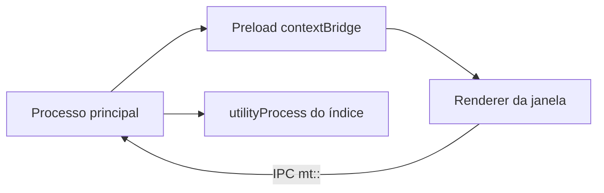

# Arquitetura

Três processos, mais o preload. Plugins de terceiros **não** rodam neste
commit: o que existe é o host dos embutidos. O desenho da comunidade está em
[Plugins da comunidade](plugins-comunidade.md).



## Processos

O principal (`packages/desktop/src/main/index.ts`) lê a linha de comando,
sobe o host de plugins, registra o IPC e, quando uma pasta é aberta, forka
um `utilityProcess` por raiz (`vaultIndexWorker.js`). Esse processo é um
filho Node, não uma sandbox: só serviços confiáveis, como o índice.

As janelas do editor e das preferências carregam o mesmo renderer, com
`contextIsolation: true`, `sandbox: true` e `nodeIntegration: false`. O
preload só pode exigir `electron` e expõe `contextBridge` (`plugins`,
`vault`, `vaultIndex`, …).

`webSecurity` está **falso** em `packages/desktop/src/main/config.ts`. O
isolamento de um iframe de plugin da comunidade só é real com
`webSecurity: true`; isso é trabalho do endurecimento do M7, não deste
commit. A CSP do renderer é a meta de `packages/desktop/src/renderer/index.html`:

```text
default-src 'self'; script-src 'self'; style-src 'self' 'unsafe-inline';
img-src * data: file:; font-src 'self' data:;
```

Não há `frame-src`. `connect-src` cai em `'self'`.

## Confiança

| Camada | Onde roda hoje | Acesso |
| --- | --- | --- |
| Plugin embutido | Renderer (UI) e, se precisar, processo principal. Código do aplicativo | API completa, sem permissão declarada |
| Índice | `utilityProcess` por pasta | Lê a pasta; não é sandbox |
| Comunidade (M7, não implementado) | iframe opaco, sem preload | API filtrada pelas permissões do manifesto |

O renderer não fala com a rede de plugin. Quem busca HTTP é o principal, via
`safeFetch`: `https` em qualquer host, `http` só em loopback, sem
redirecionamento, sem credenciais, teto de 5 MiB e tempo padrão de 15 s.

`validateSender` só aceita o frame de topo do renderer do aplicativo.
Chamadas de outro origem voltam `FAILED`.

Segredos: `safeStorage`, arquivo `secrets.json`, modo `0600`. O renderer só
vê se a chave existe.

Arquivos do plugin (`mt::vault::*`) ficam na pasta aberta da janela, ou na
pasta do arquivo ativo se nenhuma pasta estiver aberta. Fora disso,
`OUTSIDE_VAULT`.

## Host de plugins

Três listas, de propósito: o principal não empacota o código do renderer.

| Lista | Arquivo |
| --- | --- |
| Manifestos e locales | `packages/desktop/src/plugins/manifests.ts` |
| Código do renderer | `src/renderer/src/plugins/builtin.ts` |
| Código do principal | `src/main/plugins/builtin.ts` (hoje só `grammar`) |
| Handlers do índice | glob `plugins/*/worker/index.ts` |

A ordem declarada no renderer é links, tags, icons, daily-notes, dataview,
kanban, mermaid-plus, pdf-reader, grammar. Plugins diferentes sobem em
paralelo; ativar e desativar o mesmo id é serial.

Estado em `plugins.json`. Segredos à parte. `--safe` ainda serve o estado e
deixa editar, mas não chama `activate`. Ver o
[guia](../guia/modo-seguro.md).

Tudo que o plugin registra por `ctx` é descartado ao desligar, do mais novo
ao mais antigo. O `deactivate` do principal tem teto de 3 s. Falha na
ativação também descarta.

`affectsParsing: true` pede ao host para recarregar a renderização inline
dos documentos abertos depois do toggle.

## Índice da pasta

Um worker por raiz, compartilhado pelas janelas. Cache em
`<userData>/vault-index/<sha1(raiz)>.json`, versão 1, gravado 2 s depois da
última mudança. Reaproveita uma nota só se `mtimeMs` e `size` baterem.

De cada nota markdown (até 5 MiB; acima disso, metadados vazios): front
matter YAML, aliases, tags, títulos, links wiki e markdown, tarefas, campos
`chave::`, `day` se o nome for `YYYY-MM-DD`, contagem de palavras. Arquivos
que não são markdown entram como alvos de link, mas `listFiles` do renderer
só devolve notas.

IPC: `mt::index::get-file`, `list-files`, `resolve-link`, `backlinks`,
`tags`, `files-with-tag`, `request`, e os eventos `ready` / `changed`.
Pedidos de plugin no worker levam prefixo (`dataview.query`,
`links.unlinkedMentions`, `daily-notes.notes`).

## Pontos do motor

Em `@muyajs/core` (`packages/muya`), úteis sem o host:

| API | Efeito |
| --- | --- |
| `setDecorations` / `clearDecorations` | marcas só de pintura; somem quando o texto do bloco muda |
| `replaceRange` | troca um intervalo se `expected` ainda bater; um passo de desfazer |
| `getCheckableBlocks` | parágrafos, títulos e células, com anotação |
| `registerInlineSyntax` | token cujo texto é o markdown; não altera o arquivo |
| `registerCodeBlockRenderer` | pré-visualização sob o bloco. Não pode ser `mermaid`, `plantuml`, `vega-lite`, `flowchart`, `sequence`, `math` |
| `registerCompletionProvider` | lista enquanto o texto antes do cursor casa o gatilho |
| evento `content-set` | documento carregado; decorações já limpas |

`Muya.use()` continua existindo para ferramentas flutuantes. É outro
caminho, não o dos plugins.

O host do desktop embrulha isso em `ctx.editor`. O id da camada de
decoração é prefixado com o id do plugin. Clique em token inline só chega
com Ctrl/Cmd.
