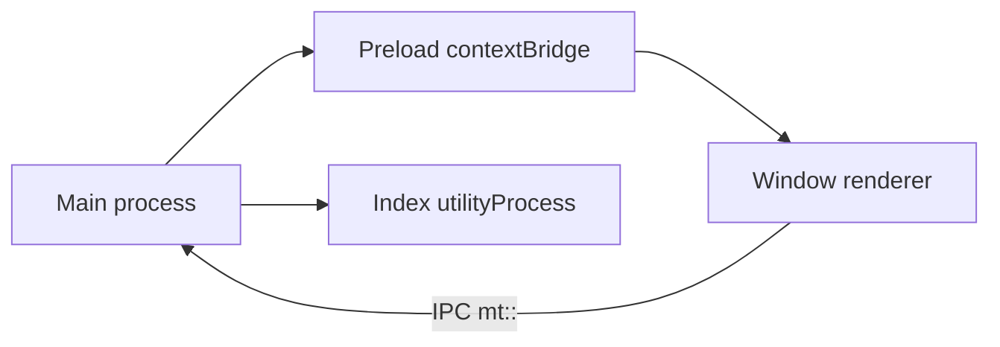

# Architecture

Three processes, plus the preload. Third-party plugins do **not** run in
this commit: what exists is the built-in host. The community design is in
[Community plugins](community-plugins.md).



## Processes

Main (`packages/desktop/src/main/index.ts`) reads the command line, starts
the plugin host, registers IPC, and, when a folder is opened, forks one
`utilityProcess` per root (`vaultIndexWorker.js`). That process is a Node
child, not a sandbox: trusted services only, such as the index.

Editor and preferences windows load the same renderer, with
`contextIsolation: true`, `sandbox: true`, and `nodeIntegration: false`. The
preload may only `require('electron')` and exposes a `contextBridge`
(`plugins`, `vault`, `vaultIndex`, …).

`webSecurity` is **false** in `packages/desktop/src/main/config.ts`. A
community plugin iframe is isolated only with `webSecurity: true`; turning
that on is M7 hardening, not this commit. The renderer CSP is the meta tag
in `packages/desktop/src/renderer/index.html`:

```text
default-src 'self'; script-src 'self'; style-src 'self' 'unsafe-inline';
img-src * data: file:; font-src 'self' data:;
```

There is no `frame-src`. `connect-src` falls under `'self'`.

## Trust

| Tier                            | Where it runs today                          | Access                               |
| ------------------------------- | -------------------------------------------- | ------------------------------------ |
| Built-in plugin                 | Renderer (UI) and, if needed, main. App code | Full API, no declared permission     |
| Index                           | one `utilityProcess` per folder              | Reads the folder; not a sandbox      |
| Community (M7, not implemented) | opaque iframe, no preload                    | API filtered by manifest permissions |

The renderer does not make plugin network calls. HTTP goes through main, via
`safeFetch`: `https` to any host, `http` only to loopback, no redirects, no
credentials, 5 MiB cap, 15 s default timeout.

`validateSender` accepts only the top frame of the app renderer. Calls from
anywhere else come back `FAILED`.

Secrets: `safeStorage`, file `secrets.json`, mode `0600`. The renderer only
learns whether a key is set.

Plugin file access (`mt::vault::*`) is limited to the folder opened in the
window, or to the active file's folder when no folder is open. Anything else
is `OUTSIDE_VAULT`.

## Plugin host

Three lists, on purpose: main does not bundle renderer code.

| List                  | File                                                     |
| --------------------- | -------------------------------------------------------- |
| Manifests and locales | `packages/desktop/src/plugins/manifests.ts`              |
| Renderer code         | `src/renderer/src/plugins/builtin.ts`                    |
| Main code             | `src/main/plugins/builtin.ts` (`grammar` and `ai` today) |
| Index handlers        | glob `plugins/*/worker/index.ts`                         |

Declared renderer order: links, tags, icons, daily-notes, dataview, kanban,
mermaid-plus, pdf-reader, grammar, ai. Different plugins start in parallel;
activate and deactivate of the same id are serial.

State lives in `plugins.json`. Secrets are separate. `--safe` still serves
state and allows edits, but does not call `activate`. See the
[guide](../guide/safe-mode.md).

Everything a plugin registers through `ctx` is disposed on disable, newest
first. Main `deactivate` has a 3 s cap. Activation failure disposes too.

`affectsParsing: true` asks the host to refresh inline rendering of open
documents after a toggle.

## Folder index

One worker per root, shared by windows. Cache at
`<userData>/vault-index/<sha1(root)>.json`, version 1, written 2 s after the
last change. A note is reused only when `mtimeMs` and `size` match.

From each markdown note (up to 5 MiB; above that, empty metadata): YAML
front matter, aliases, tags, headings, wiki and markdown links, tasks,
`key::` fields, `day` when the name is `YYYY-MM-DD`, word count. Non-markdown
files are kept as link targets, but renderer `listFiles` returns notes only.

IPC: `mt::index::get-file`, `list-files`, `resolve-link`, `backlinks`,
`tags`, `files-with-tag`, `request`, and the `ready` / `changed` events.
Plugin requests in the worker are prefixed (`dataview.query`,
`links.unlinkedMentions`, `daily-notes.notes`).

## Engine extension points

In `@muyajs/core` (`packages/muya`), useful without the host:

| API                                   | Effect                                                                                                   |
| ------------------------------------- | -------------------------------------------------------------------------------------------------------- |
| `setDecorations` / `clearDecorations` | paint-only marks; dropped when the block text changes                                                    |
| `replaceRange`                        | replaces a range only if `expected` still matches; one undo step                                         |
| `getTextSelection`                    | anchor/focus as block path + text offset; kept while the editor is blurred                               |
| `insertMarkdownBlocks`                | parses markdown and inserts the blocks after a top-level block; one undo step                            |
| `getCheckableBlocks`                  | paragraphs, headings, and cells, with an annotation                                                      |
| `registerInlineSyntax`                | a token whose text is the markdown; cannot change the file                                               |
| `registerCodeBlockRenderer`           | preview under the block. Must not be `mermaid`, `plantuml`, `vega-lite`, `flowchart`, `sequence`, `math` |
| `registerCompletionProvider`          | a list while the text before the caret matches the trigger                                               |
| `content-set` event                   | document loaded; decorations already cleared                                                             |

`Muya.use()` still exists for floating tools. That is a different path, not
the plugin one.

The desktop host wraps this as `ctx.editor`. Decoration layer ids are
prefixed with the plugin id. An inline-token click is delivered only on
Ctrl/Cmd-click.
