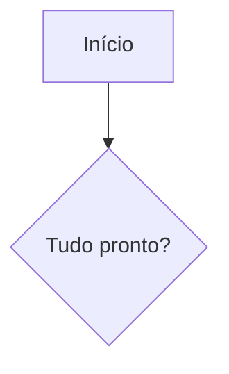
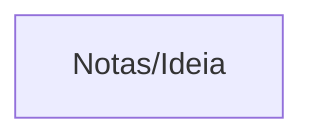

# Mermaid

Temas, traço desenhado à mão e `Ctrl`/`Cmd`+clique em nós `internal-link`.
Ligado por padrão. Id: `mermaid-plus`.

O diagrama continua sendo o bloco que o editor já tinha:

````markdown

````

Este plugin não troca o Mermaid por outro renderizador e não converte
`flowchart` / `sequence` antigos (flowchart.js e js-sequence) em Mermaid.
PlantUML e Vega-Lite também ficam como estão.

## Configurações

| Chave | Padrão | Opções |
| --- | --- | --- |
| `theme` | `auto` | `auto`, `default`, `neutral`, `forest`, `dark`, `base` |
| `look` | `classic` | `classic`, `handDrawn` |

`auto` segue o tema claro ou escuro do aplicativo. A pré-visualização ao
vivo usa essas opções. A exportação de diagrama pelo caminho antigo do
editor ainda segue só o tema do aplicativo, sem o traço à mão.

## Inserir um exemplo

Na paleta, **Inserir diagrama: …**. O cursor precisa estar num parágrafo.
Os tipos: fluxograma, sequência, classes, estados, entidade-relacionamento,
Gantt, pizza, mapa mental, linha do tempo, quadrantes. Os ids são
`mermaid-plus.insert-flowchart`, `insert-sequence`, `insert-class`,
`insert-state`, `insert-er`, `insert-gantt`, `insert-pie`, `insert-mindmap`,
`insert-timeline`, `insert-quadrant`. Sem atalho.

Os rótulos do exemplo seguem o idioma da interface.

## Links internos

Como no Obsidian, um nó com a classe `internal-link`:



`Ctrl`/`Cmd`+clique abre o alvo, resolvido como o miolo de um wikilink
(`Nota`, `Pasta/Nota`, `doc.pdf#page=3`). Precisa de uma pasta aberta. Se
não resolver, um aviso aparece; a nota não é criada. Clique sem o modificador
só foca o código.

## Limitações

Qualquer diagrama que a versão embutida do Mermaid consiga analisar é
desenhado. O plugin não acrescenta sintaxe. Não há atalho de inserção.
