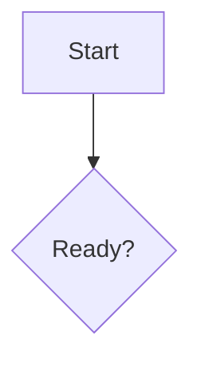
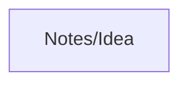

# Mermaid

Themes, a hand-drawn look, and `Ctrl`/`Cmd`-click on `internal-link` nodes.
On by default. Id: `mermaid-plus`.

The diagram stays the block the editor already had:

````markdown

````

This plugin does not replace Mermaid with another renderer, and it does not
turn the older `flowchart` / `sequence` blocks (flowchart.js and
js-sequence) into Mermaid. PlantUML and Vega-Lite are unchanged.

## Settings

| Key | Default | Options |
| --- | --- | --- |
| `theme` | `auto` | `auto`, `default`, `neutral`, `forest`, `dark`, `base` |
| `look` | `classic` | `classic`, `handDrawn` |

`auto` follows the app's light or dark theme. The live preview uses these
options. Diagram export through the editor's older path still follows only
the app theme, without the hand-drawn look.

## Insert an example

In the palette, **Insert diagram: …**. The caret must be in a paragraph.
Kinds: flowchart, sequence, class, state, entity relationship, Gantt, pie,
mind map, timeline, quadrant. Ids are `mermaid-plus.insert-flowchart`,
`insert-sequence`, `insert-class`, `insert-state`, `insert-er`,
`insert-gantt`, `insert-pie`, `insert-mindmap`, `insert-timeline`,
`insert-quadrant`. No shortcut.

Example labels follow the UI language.

## Internal links

As in Obsidian, a node with the class `internal-link`:



`Ctrl`/`Cmd`-click opens the target, resolved as the inside of a wikilink
(`Note`, `Folder/Note`, `doc.pdf#page=3`). An open folder is required. If it
does not resolve, a notice appears; the note is not created. A click without
the modifier only focuses the source.

## Limitations

Any diagram the bundled Mermaid can parse is drawn. The plugin adds no
syntax. There is no insert shortcut.
